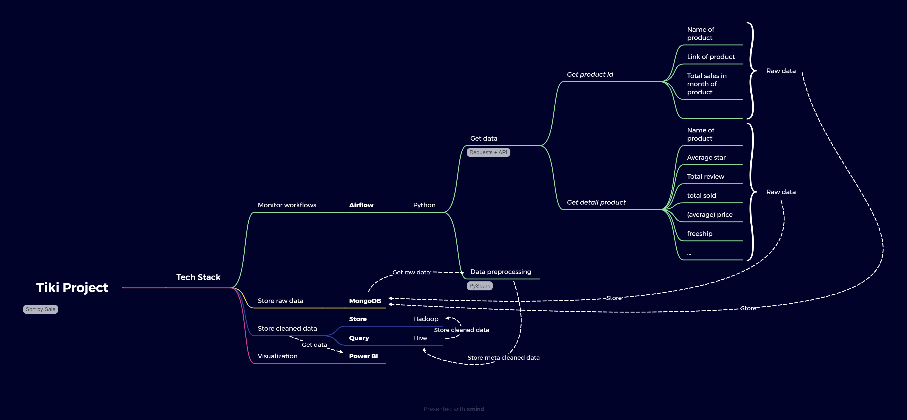

# Project_Tiki_ETL_Visualization
## Tech Stack:
+ Monitor workflows: Airflow
+ Get data from API Tiki: Python (Requests)
+ Store raw data: MongoDB
+ Data cleaning: Spark
+ Store cleaned data: Hadoop + Hive
+ Data visualization: Power BI
## Mind Map:

